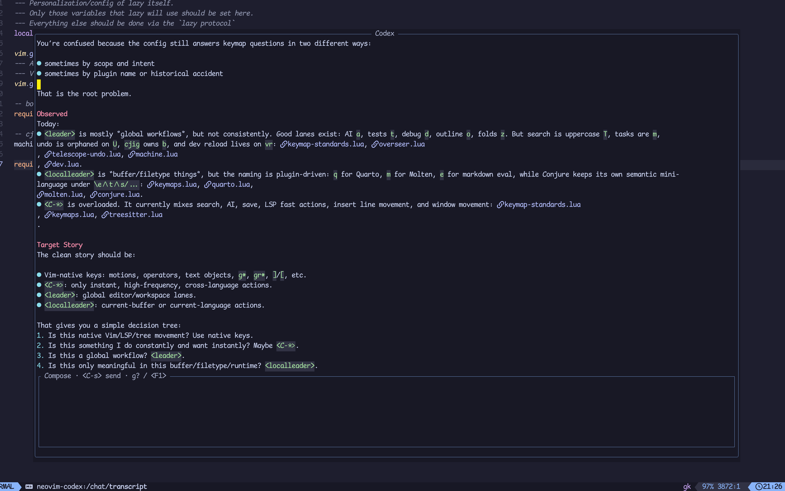
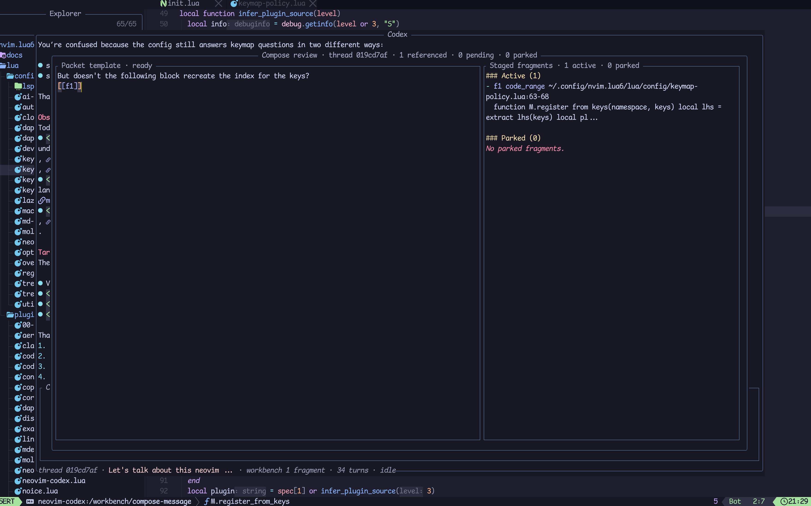
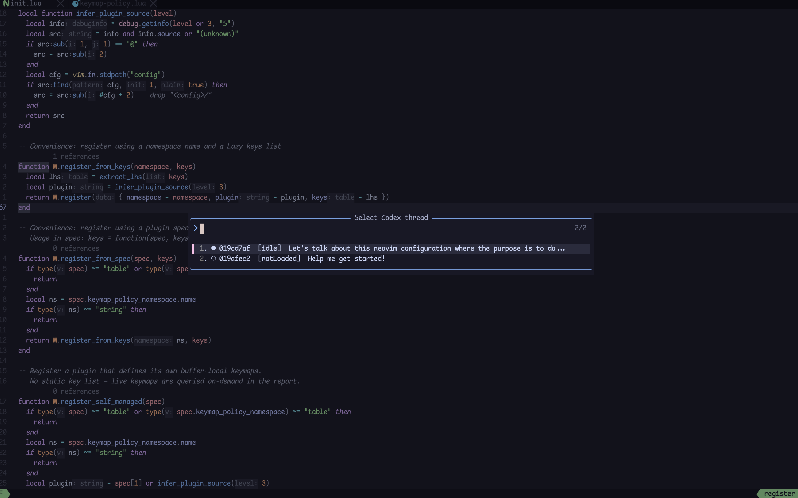

# neovim-codex

A NeoVim-hosted client for `codex app-server`.

This is not Codex inside a floating terminal. `neovim-codex` speaks the app-server protocol directly and keeps thread, turn, request, workbench, and packet state inside NeoVim.

## What You Get

- a rail-first markdown-native chat shell with a widened reader mode
- thread-aware approvals and `requestUserInput` flows that reopen safely
- thread/session controls for create, switch, fork, archive, rename, model, effort, and collaboration mode
- a workbench and compose review flow for packet-backed follow-up context
- a pure Lua client/state core instead of a terminal wrapper

Today, the plugin already supports the usable core loop:

- start and talk to `codex app-server`
- create, resume, read, fork, rename, archive, and tune threads
- inspect activity without drowning the main transcript in raw command noise
- stage code, diagnostics, and runtime notes into a workbench
- preview and send compiled packets with explicit `[[fN]]` fragment handles

It does **not** yet implement dynamic tools or language-specific adapter daemons, but the app-server-native chat/session/workbench loop is already in place.

## Screenshots

### Main chat overlay



App-server-native chat inside NeoVim, with a rail-first shell, explicit inbox state, and visible thread/workbench status.

### Workbench and compose review



Stage fragments from the code world, park the ones you do not want yet, place `[[fN]]` handles where they matter, and preview the compiled packet before sending.

### Thread and session controls



Switch threads, fork from earlier turns, and steer sticky runtime settings like model, effort, and collaboration mode without leaving the editor.

## Requirements

- NeoVim `0.11+`
- local `codex` executable on `PATH`
- [`MunifTanjim/nui.nvim`](https://github.com/MunifTanjim/nui.nvim) for the overlay layout

Optional but useful:

- [`MeanderingProgrammer/render-markdown.nvim`](https://github.com/MeanderingProgrammer/render-markdown.nvim) if you already use it for markdown buffers

Check prerequisites inside NeoVim:

```vim
:echo has('nvim-0.11')
:echo executable('codex')
```

Both commands should print `1`.

## Installation

### lazy.nvim

For a normal install from a Git remote, add a plugin spec like this to your `lazy.nvim` setup.
Install from the public GitHub repository:

```lua
{
  "jaju/neovim-codex",
  dependencies = {
    "MunifTanjim/nui.nvim",
  },
  config = function()
    require("neovim_codex").setup({
      keymaps = {
        global_modes = { "n", "i", "x" }, -- keep your global Codex shortcuts available across common modes
        global = {
          chat = false, -- set a mapping like "<C-,>" to toggle the chat overlay
          threads = false, -- open the thread picker
          request = false, -- reopen the active approval or question
          workbench = false, -- toggle the thread-local workbench tray
          compose = false, -- open compose review for the active thread
          capture_path = false, -- stage the current file path into the workbench
          capture_selection = false, -- stage the current visual selection as a code fragment
          capture_diagnostic = false, -- stage the diagnostic under cursor
        },
      },
    })
  end,
}
```

For local development or dogfooding, use a `dir = ...` spec instead. That workflow is documented in [`docs/usage/lazy-nvim.md`](docs/usage/lazy-nvim.md).

`client_info`, `experimental_api`, and `max_log_entries` are plugin-managed defaults. They are omitted here on purpose because they are not meaningful day-to-day user configuration knobs.

Then inside NeoVim:

```vim
:Lazy sync
:Lazy load neovim-codex
:checkhealth neovim_codex
:CodexSmoke
```

A more explicit step-by-step guide lives in [`docs/usage/lazy-nvim.md`](docs/usage/lazy-nvim.md).

## First Chat Flow

From your normal NeoVim session:

```vim
:CodexChat
```

Then:

1. write your prompt in the composer at the bottom of the overlay
2. press `<C-s>` or run `:CodexSend`
3. watch the transcript stream above it
4. run `:CodexChat` again to hide the overlay

Useful thread commands:

- `:CodexThreadNew` - create and activate a fresh thread
- `:CodexThreadNewConfig` - create a thread with runtime settings like model, effort, mode, name, and ephemeral state
- `:CodexThreads` - pick and resume a stored thread
- `:CodexThreadRead` - inspect a stored thread without resuming it
- `:CodexThreadRename [name]` - rename the active thread, or prompt asynchronously for a name
- `:CodexThreadFork [thread-id]` - fork from a chosen turn in the active thread, or the supplied thread id
- `:CodexThreadArchive [thread-id]` - archive the active thread, or pick/archive another thread
- `:CodexThreadSettings [thread-id]` - open the editable thread settings sheet for model, effort, and collaboration mode
- `:CodexInterrupt` - interrupt the running turn, if any
- `:CodexRequest` - reopen the active approval or question request if one is pending
- `:CodexShortcuts` - open the Codex shortcut sheet for the current surface

Workbench and compose commands:

- `:CodexWorkbench` - toggle the thread-local workbench tray
- `:CodexCompose` - open compose review for the current thread
- `:CodexCapturePath` - stage the current file as a `path_ref` fragment
- `:CodexCaptureSelection` - stage the current visual selection as a `code_range` fragment
- `:CodexCaptureDiagnostic` - stage the current diagnostic under cursor as a `diagnostic` fragment
- Lua API: `require("neovim_codex").capture_text_fragment({ label = "Latest test run", text = "...", filetype = "markdown", source = "neotest", category = "runtime" })` stages a first-class `text_note` fragment for runtime context, tool output, logs, or notes
- workbench capture is code-world first in this slice; chat text can still be copied manually when needed

## Commands

- `:CodexStart` - start `codex app-server` and complete the initialize handshake
- `:CodexStop` - stop the running app-server process
- `:CodexStatus` - print current connection state and active thread id
- `:CodexEvents` - open the protocol event log in the stacked viewer layer
- `:CodexSmoke` - run the current smoke checks and open a report buffer
- `:CodexChat` - toggle the default Codex shell mode
- `:CodexChatRail` - open the narrow side-rail shell explicitly
- `:CodexChatReader` - open the widened reader explicitly
- `:CodexSend` - send the current composer contents, or open compose review if the workbench is non-empty
- `:CodexThreadNew` - create a new thread and activate it
- `:CodexThreadNewConfig` - create a new thread through the runtime configuration flow
- `:CodexThreads` - pick and resume a stored thread
- `:CodexThreadRead [thread-id]` - read a thread into a report buffer
- `:CodexThreadRename [name]` - rename the active thread, or prompt for a name
- `:CodexThreadFork [thread-id]` - fork from a chosen turn in the active thread, or the supplied thread id
- `:CodexThreadArchive [thread-id]` - archive the active thread, or pick one to archive
- `:CodexThreadSettings [thread-id]` - adjust sticky model, effort, and collaboration mode for a thread
- `:CodexInspect` - push a details viewer for the selected transcript block
- `:CodexInterrupt` - interrupt the active turn
- `:CodexRequest` - reopen the active pending Codex request
- `:CodexShortcuts` - open the Codex shortcut sheet for the current surface
- `:CodexWorkbench` - toggle the workbench tray for the active thread
- `:CodexCompose` - open compose review for the active thread
- `:CodexCapturePath` - stage the current file as a fragment
- `:CodexCaptureSelection` - stage the current visual selection as a code fragment
- `:CodexCaptureDiagnostic` - stage the current diagnostic under cursor as a fragment
- `:checkhealth neovim_codex` - verify NeoVim version, `codex` availability, `nui.nvim`, and handshake viability

## Keymaps

Global mappings are disabled by default, but when you set them they can be applied across multiple modes through `keymaps.global_modes`. Buffer-local mappings exist only inside plugin-owned Codex buffers. Use `g?` or `<F1>` inside a Codex surface to reopen the current shortcut sheet, which is grouped into "This surface", "Global fast", and "Global workflow" lanes.

Transcript buffer defaults:

- `q` - hide the overlay
- `gr` - reopen the active thread inbox
- `gR` - toggle between rail and reader widths
- `i` - focus the composer
- insert-like keys in the transcript (`a`, `A`, `i`, `I`, `o`, `O`, `R`) also jump to the composer instead of entering insert mode in the read-only transcript
- `<C-w>w` - switch between transcript and composer without leaving the overlay
- `<CR>` - push the selected transcript block onto the viewer stack
- `[[` - jump to the previous turn boundary
- `]]` - jump to the next turn boundary
- `g?` or `<F1>` - open the Codex shortcut sheet for the current surface

Composer buffer defaults:

- `<C-s>` - send the current draft from normal or insert mode
- `gS` - send the current draft from normal mode
- `<C-w>w` in normal mode - switch back to the transcript
- `q` in normal mode - hide the overlay
- `gr` - reopen the active thread inbox
- `gR` - toggle between rail and reader widths
- `g?` or `<F1>` in normal mode - open the Codex shortcut sheet for the current surface
- `<CR>` - insert a newline

Pending request viewer defaults:

- the viewer is read-only and opens in normal mode
- `<CR>` - resolve the current request
- `a` - approve once when that decision exists
- `s` - approve for session when that decision exists
- `d` - decline
- `c` - cancel
- `g?` or `<F1>` - open the Codex shortcut sheet for the current surface
- `q` or `<Esc>` - hide the request viewer without resolving the request

All mappings are configurable through `setup()` and merged over defaults. Set a mapping to `false` to disable it. Use `keymaps.global_modes = { "n", "i", "x" }` (the default) to keep global Codex shortcuts available without changing modes.

```lua
require("neovim_codex").setup({
  keymaps = {
    global = {
      chat = "<leader>ac",
      threads = "<leader>at",
      read_thread = "<leader>aT",
      workbench = "<leader>aw",
      compose = "<leader>ap",
      capture_path = "<leader>af",
      capture_selection = "<leader>as",
    },
    transcript = {
      focus_composer = "i",
      inspect = "<CR>",
      next_turn = "]c",
      prev_turn = "[c",
    },
    composer = {
      send = "<leader>as",
      send_normal = false,
    },
  },
})
```

If `<C-s>` is captured by terminal flow control, either run `stty -ixon` for that shell or remap `keymaps.composer.send` and `keymaps.compose_review.send`.

## Protocol-First Transcript Mapping

The transcript is derived from the app-server protocol types, not from shell-string heuristics.

Blocking app-server server requests are also protocol-first. Command approvals, file-change approvals, and tool questions do not render as transcript items. They open in a stacked request viewer in normal mode, use your configured `vim.ui.select` for option choices, and open a focused stacked text-answer popup for free-form responses. Use `:CodexRequest` to reopen the current request if you close it before responding.

Examples:

- successful `commandExecution` items with typed `commandActions` like `read`, `listFiles`, or `search` are compacted into single-line activity summaries
- in-progress execution stays in the footer instead of occupying transcript space
- failed or unknown commands stay compact in the transcript but open into a details inspector on demand
- typed item families such as file changes, tool calls, review mode, and context compaction each map to their own UI surface with their raw protocol preserved

The raw wire payload for each rendered item is preserved in transcript block metadata for future plucking, filtering, export, or enrichment flows. Secondary viewers like `:CodexInspect`, `:CodexEvents`, reports, the workbench tray, and packet preview now share a popup stack so the latest focused viewer can be closed back to the previous one with `q` or `<Esc>`.

For the design contract, see [`docs/architecture/protocol-first.md`](docs/architecture/protocol-first.md).

## Markdown Buffer Contract

The overlay transcript and composer are plain markdown buffers with normal NeoVim buffer contracts:

- `buftype=nofile`
- `bufhidden=hide`
- `swapfile=false`
- `filetype=markdown`

The plugin tags its buffers with buffer variables so your own markdown autocommands or renderers can target them cleanly:

- `b:neovim_codex = true`
- `b:neovim_codex_role = "transcript" | "composer" | "details" | "events"`
- `b:neovim_codex_thread_id = <thread-id>`

That means existing markdown treesitter, conceal, render-markdown, and ftplugin customization can apply naturally inside the overlay.

The overlay also exposes heading highlight groups you can override in your own config:

- `NeovimCodexChatTurnHeading`
- `NeovimCodexChatUserHeading`
- `NeovimCodexChatAssistantHeading`
- `NeovimCodexChatPlanHeading`
- `NeovimCodexChatReasoningHeading`
- `NeovimCodexChatActivityHeading`
- `NeovimCodexChatCommandHeading`
- `NeovimCodexChatFileChangeHeading`
- `NeovimCodexChatToolHeading`
- `NeovimCodexChatReviewHeading`
- `NeovimCodexChatNoticeHeading`

## Current Limitations

- a newly created thread without a persisted user turn may not appear in `thread/list` yet and may not be resumable from storage yet
- `thread/read` with `includeTurns=true` can fail for an empty thread before the first user message is persisted; the plugin falls back to a metadata-only read in that case
- the transcript now keeps activity terse by default and routes verbose execution detail through `:CodexInspect`; raw protocol remains in `:CodexEvents`


## Contract Tracking

The plugin keeps a narrow watched contract for the Codex app-server surface it depends on.

- the upstream source of truth is the local Codex checkout at `CODEX_REPO_ROOT`
- `CODEX_REPO_ROOT` is intended to come from a local `.envrc` loaded by `direnv`
- human-facing contract docs live under `docs/contracts/`
- the machine-checked manifest lives at `contracts/codex-app-server/watch-manifest.json`
- checked snapshots of the watched generated TypeScript files live under `contracts/codex-app-server/snapshots/`
- `scripts/check_codex_app_server_contracts.py` compares the current Codex schema against those snapshots
- `./scripts/contracts-check` is the preferred drift-check entrypoint

Create a local `.envrc` from `.envrc.example`, point `CODEX_REPO_ROOT` at your Codex checkout root, then run `direnv allow`.

Use `./scripts/contracts-check` when the local Codex source tree changes and `./scripts/contracts-check --generate` when you intentionally want to compare against the installed `codex` binary instead of the configured checkout.

## Development Workflow

- Run the automated checks with `./scripts/test`
- Use the in-editor dogfood loop:
  1. `:Lazy reload neovim-codex`
  2. `:checkhealth neovim_codex`
  3. `:CodexChat`
  4. `:CodexThreadNew`
  5. write a short prompt in the composer and press `<C-s>`
  6. inspect `:CodexEvents` if something looks wrong

A fuller workflow note lives in [`docs/development/workflow.md`](docs/development/workflow.md).

## Configuration

```lua
require("neovim_codex").setup({
  keymaps = {
    global_modes = { "n", "i", "x" }, -- make your chosen global Codex shortcuts work across common modes
    global = {
      chat = "<C-,>", -- toggle the chat overlay
      threads = "<leader>ct", -- open the thread picker
      request = "<leader>cq", -- reopen the active approval or question
      workbench = "<leader>cw", -- toggle the workbench tray
      compose = "<leader>cp", -- open compose review
      capture_path = "<leader>cf", -- stage the current file path
      capture_selection = "<leader>cx", -- stage the current visual selection
      capture_diagnostic = "<leader>cd", -- stage the diagnostic under cursor
    },
  },
  ui = {
    chat = {
      layout = {
        width = 0.88, -- relative editor width for the main chat overlay
        height = 0.84, -- relative editor height for the main chat overlay
        border = "rounded", -- border style passed through to the floating layout
      },
      composer = {
        min_height = 6, -- keep the composer comfortably multiline
        max_height = 12, -- cap the composer so transcript space is preserved
      },
    },
    workbench = {
      tray = {
        width = 0.34, -- compact peek window for staged fragments
        height = 0.30,
      },
    },
  },
})
```

Most users only need `keymaps.global`.

Use `codex_cmd` only if `codex` is not on your `PATH` or you want to point at a specific binary. The `client_info`, `experimental_api`, and log-limit fields are plugin-owned defaults and are intentionally left out of normal user config examples.

The older `ui.chat.width`, `ui.chat.prompt_height`, `ui.chat.wrap`, and `keymaps.prompt` values are normalized into the new layout/composer shape so your local config does not break immediately.

## Repository Layout

- `lua/neovim_codex/core/` - pure Lua protocol, selectors, and state logic
- `lua/neovim_codex/nvim/chat/` - semantic document projection, overlay surface, and composer modules
- `lua/neovim_codex/nvim/` - NeoVim runtime bridge and presentation helpers
- `plugin/` - user command registration
- `docs/architecture/` - stable architecture notes
- `docs/development/` - local development and dogfooding workflow
- `docs/episodes/` - episodic progress notes for future context injection
- `docs/usage/` - installation and usage flows
- `tests/` - headless unit and integration test runners
- `scripts/` - local development commands

## Next Steps

1. add thread history UI with server-backed fork and rollback
2. add explicit prompt composition from buffer, LSP, and tree-sitter context
3. add dynamic tools and the first TypeScript adapter daemon


Lua API:
- `require("neovim_codex").capture_text_fragment({ label = "Latest test run", text = "...", filetype = "markdown", source = "neotest", category = "runtime" })` stages a first-class `text_note` fragment without pretending the text came from a file.
